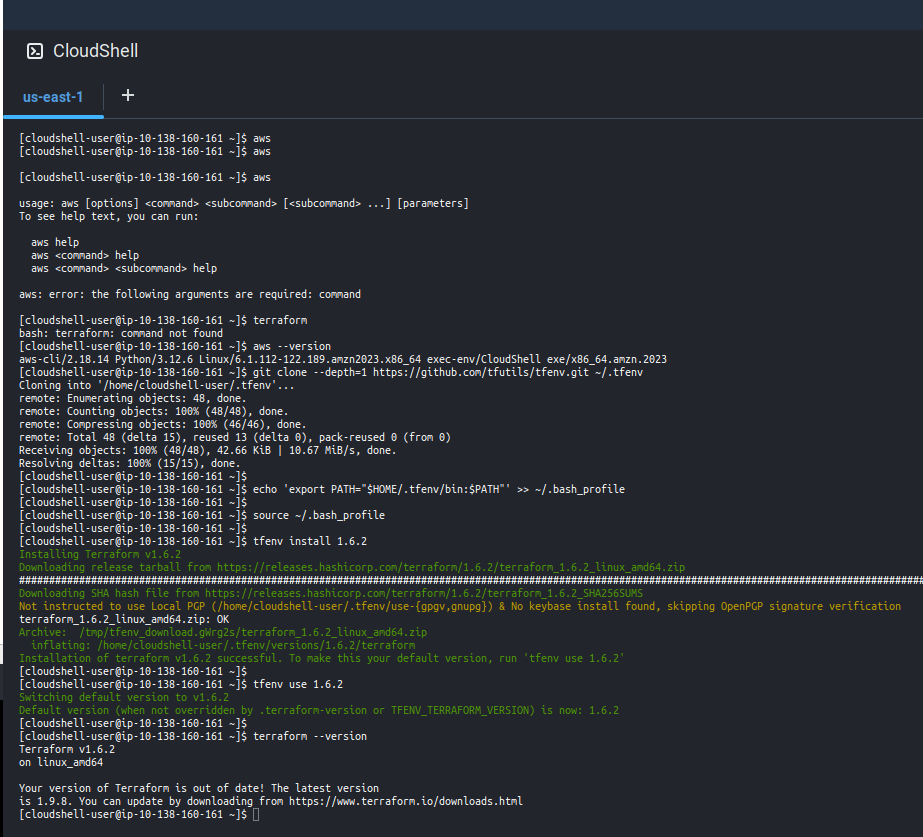

# Advanced Terraform with AWS

## Table of Contents

1. [Introduction](#introduction)
2. [Setup and Configuration](#setup-and-configuration)
3. [AWS Provider in Terraform Registry](#aws-provider-in-terraform-registry)
4. [Hello World](#hello-world)
5. [Modules](#modules)
6. [State Management](#state-management)
7. [Provisioners](#provisioners)
8. [Workspaces](#workspaces)
9. [Best Practices](#best-practices)
10. [Troubleshooting](#troubleshooting)
11. [References](#references)

## Introduction

This readme.md delves into the relationship between Terraform and AWS, focusing on best practices for developing secure, scalable, and manageable Terraform configurations for AWS.

Major topics include:

* Building a solid Terraform backend in AWS
* Reviewing security best practices for Terraform
* Deploying multi-region architectures with Terraform in AWS

### Prerequisites

1. Terraform Knowledge:

    * Understanding of providers, configurations, states, resources, data sources, variables, outputs, and HCL syntax (blocks, loops, conditionals).

2. AWS Knowledge:

    * Familiarity with EC2, VPC, IAM, Load Balancing, S3, DynamoDB, AWS developer tools (CodeBuild, CodePipeline, CodeCommit), and RDS.

## Setup and Configuration

### Installing Terraform

Steps to install Terraform on AWS Cloud shell.

1. Open AWS cloud shell
    * Log in to your AWS Management Console.
    * Click on the Cloud Shell icon in the top-right or bottom-left  navigation bar (a terminal icon) or search for "Cloud Shell" in the search bar and select it.

    

2. Install terraform with tfenv:

    ```bash
    git clone --depth=1 https://github.com/tfutils/tfenv.git ~/.tfenv
    
    echo 'export PATH="$HOME/.tfenv/bin:$PATH"' >> ~/.bash_profile
    
    source ~/.bash_profile

    tfenv install 1.6.2

    tfenv use 1.6.2

    terraform --version
    ```

Detail of tfenv is [here](https://github.com/tfutils/tfenv).



## AWS Provider in Terraform Registry

### Introduction to AWS Provider

The AWS Provider is a crucial component in Terraform that allows Terraform to interact with AWS services. It acts as a wrapper around Terraform, helping manage the lifecycle of AWS resources. This provider is publicly available in the Official Terraform Registry.

**Key Concepts**

1. Provider:

    * Directly matches the resource in AWS with the one defined in Terraform.

2. Module:

    * A group of multiple resources in one Terraform block for convenience.

### Navigating the Terraform AWS Registry

[**AWS Provider Documentation**](https://registry.terraform.io/providers/hashicorp/aws/latest).

The official AWS Provider documentation is available in the Terraform Registry. It includes detailed information on how to use the provider and manage various AWS services.

1. Example: EC2 Instance:

    * To create an EC2 instance, you can find the aws_instance resource in the documentation. It provides examples and detailed descriptions of all possible arguments and configurations.

2. Modules:

* The registry also includes top downloaded AWS modules, such as the VPC module. Modules compact multiple resources like NAT gateways, subnets, and route tables into a single piece of code for easier management.

### Using the AWS Provider

To use the AWS Provider, add the following to your Terraform configuration:

```bash
provider "aws" {
  region = "us-west-2"
}
```

Example: Creating an EC2 Instance Resource

```bash
resource "aws_instance" "example" {
  ami           = "ami-0c55b159cbfafe1f0"
  instance_type = "t2.micro"

  tags = {
    Name = "example-instance"
  }
}
```

Detail can be found [here](https://registry.terraform.io/providers/hashicorp/aws/latest/docs/resources/instance)

Example: Using a VPC Module

```bash
module "vpc" {
  source  = "terraform-aws-modules/vpc/aws"
  version = "3.10.0"

  name = "my-vpc"
  cidr = "10.0.0.0/16"

  azs             = ["us-west-2a", "us-west-2b", "us-west-2c"]
  private_subnets = ["10.0.1.0/24", "10.0.2.0/24", "10.0.3.0/24"]
  public_subnets  = ["10.0.101.0/24", "10.0.102.0/24", "10.0.103.0/24"]

  enable_nat_gateway = true
  single_nat_gateway = true

  tags = {
    Terraform = "true"
    Environment = "dev"
  }
}
```

Detail can be found [here](https://registry.terraform.io/modules/terraform-aws-modules/vpc/aws/latest)

## Hello World

Creating Your First Terraform Configuration with AWS


### Step 1: Set Up the AWS Provider

First, we need to set up the AWS provider. Create a new file called `terraform.tf` and add the following configuration:

```bash
terraform {
  required_providers {
    aws = {
      source = "hashicorp/aws"
    }
  }
}
```

We can get this from the `USE PROVIDER` section of the terraform aws provider registry [here](https://registry.terraform.io)

### Step 2: Define the EC2 Instance

Next, we will define an EC2 instance. We will use Amazon Linux as the AMI. Add the following following `data source` to get the latest Amazon Linux AMI in a new file named `main.tf` to :

```bash
data "aws_ami" "amazon_linux" {
  most_recent = true
  owners      = ["amazon"]

  filter {
    name   = "architecture"
    values = ["x86_64"]
  }

  filter {
    name   = "name"
    values = ["al2023-ami-2023*"]
  }
}
```

Now, we will define the EC2 instance `resource` using the AMI data source in the `main.tf` file:

```bash
resource "aws_instance" "web" {
  ami           = data.aws_ami.amazon_linux.id
  instance_type = "t3.micro"
}
```

The details can be found in the [documentation](https://registry.terraform.io/providers/hashicorp/aws/latest/docs/resources/instance).

### Step 3: Initialize Terraform

Initialize Terraform to download the necessary providers:

```bash
terraform init
```

### Step 4: Apply the Configuration

Apply the configuration to create the EC2 instance:

```bash
terraform apply
```

Type yes when prompted to confirm the action.

### Step 5: Add User Data for Apache Installation

Create a script to `install Apache`. Create a folder called scripts and a file named `scripts/userdata.sh` with the following content:

```bash
#! /bin/bash

sudo yum update -y
sudo yum install -y httpd.x86_64
sudo systemctl start httpd.service
sudo systemctl enable httpd.service
```

Update main.tf to include the user data:

```bash
resource "aws_instance" "web" {
  ami           = data.aws_ami.this.id
  instance_type = "t3.micro"

  user_data              = filebase64("scripts/user_data.sh")
}
```

### Step 6: Create a Security Group

Create a security group to allow HTTP access. Add the following to `main.tf`:

```bash
resource "aws_security_group" "allow_http" {
  name        = "allow_http"
  description = "Allow HTTP inbound traffic"
  vpc_id      = data.aws_vpc.this.id

  ingress {
    description = "HTTP from VPC"
    from_port   = 80
    to_port     = 80
    protocol    = "tcp"
    cidr_blocks = ["0.0.0.0/0"]
  }

  egress {
    from_port   = 0
    to_port     = 0
    protocol    = "-1"
    cidr_blocks = ["0.0.0.0/0"]
  }
}
```

Also update the main resource:

```bash
resource "aws_instance" "web" {
  ami           = data.aws_ami.this.id
  instance_type = "t3.micro"
  vpc_security_group_ids = [aws_security_group.allow_http.id]
  user_data              = filebase64("scripts/user_data.sh")
}
```

### Step 7: Apply the Updated Configuration

Apply the updated configuration:

```bash
terraform apply
```

Type `yes` when prompted to confirm the action.

### Step 8: Output the Public IP

Add an output block in the `main.tf` to get the public IP of the instance:

```bash
output "public_ip" {
  value = aws_instance.web.public_ip
}
```

Apply the configuration again to see the output:

```bash
terraform apply -auto-approve
```

The whole example can be found [here](https://github.com/pluralsight-cloud/Advanced-Terraform-with-AWS/tree/main/section-2/01-create-first-configuration)

### Step 9: Adding Default Tags

#### Importance of Tags

Tags are a best practice not only in AWS but almost everywhere. They provide metadata that allows us to:

* Identify resources
* Group resources
* Simplify resource management
* Improve cost analysis insights
* Configure granular permissions

#### Using Default Tags in AWS Provider

While we can add tags individually to each resource, there's a special configuration in the AWS provider that allows us to set default tags. This centralizes tag management and makes it easier to maintain.

#### Setting Up Default Tags

1. Set up default tags in our Terraform configuration.

    In your `terraform.tf` file, add the `default_tags` block to the AWS provider configuration:

    ``` bash
    provider "aws" {

    default_tags {
        tags = {
            Environment = "test"
            Project     = "web-server"
        }
    }
    ```

2. Apply the Changes:

    Run the following command to apply the changes:

    ```bash
    terraform apply
    ```

    Review the changes and type yes to confirm.

3. Validate the Tags in AWS Console:

    * Go to the AWS Management Console.
    * Navigate to the EC2 instance and check the tags tab to see the new tags.
    * Also, check the security group to ensure the tags are applied there as well.

### AWS Credentials

There are multiple ways the AWS provider authenticates with AWS:

1. Provider Configuration:
    * You can specify the access key, secret key, and region directly in the provider block.
    * This method is quick to start but not secure as credentials are in plain code.

    ```bash
    provider "aws" {
        access_key = "your-access-key"
        secret_key = "your-secret-key"
        region     = "us-west-2"
    }
    ```

2. Environment Variables:

    * The provider block can be empty, and Terraform will use the configuration from environment variables.

    ```bash
    provider "aws"{}
    ```

    * The required environment variables are:

    ```bash
    export AWS_ACCESS_KEY_ID="your-access-key"
    export AWS_SECRET_ACCESS_KEY="your-secret-key"
    export AWS_DEFAULT_REGION="us-west-2"
    ```

3. Shared Configuration and Credential Files:

    * These files are automatically generated by running the aws configure command.

    ```bash
    aws configure
    ```

    * Terraform can use these files for authentication.

    ```bash
    provider "aws" {
        shared_config_file = "~/.aws/conf"
        shared_credentials_file = "~/.aws/creds"
        profile                 = "prod"
    }
    ```

4. Container Credentials:

    * For ECS containers, Terraform can use the following environment variables:

    ```bash
    export AWS_CONTAINER_CREDENTIALS_RELATIVE_URI="relative-uri"
    export AWS_CONTAINER_CREDENTIALS_FULL_URI="full-uri"
    ```

    * For EKS using IAM Roles for Service Accounts, Terraform can use:

    ```bash
    export AWS_WEB_IDENTITY_TOKEN_FILE="token-file"
    export AWS_ROLE_ARN="role-arn"
    ```

5. Instance Profile Credentials and Region:

    * Available through the Instance Metadata Service (IMDS).
    * Terraform supports both IMDSv1 and IMDSv2, with IMDSv2 being recommended.

### Backend Configuration

Configuring remote backends for storing Terraform state.

## Modules

### Creating Modules

How to create reusable Terraform modules.

### Using Modules

How to use existing modules in your Terraform configuration.

### Module Registry

Using the Terraform Module Registry to find and use modules.

## State Management

### Remote State

Configuring remote state storage.

### State Locking

Understanding state locking and how to manage it.

### State Commands

Common state commands (`terraform state list`, `terraform state show`, etc.).

## Provisioners

### Using Provisioners

How to use provisioners to execute scripts on remote resources.

### Common Provisioners

Examples of common provisioners like `local-exec` and `remote-exec`.

## Workspaces

### Creating Workspaces

How to create and switch between workspaces.

### Workspace Commands

Common workspace commands (`terraform workspace list`, `terraform workspace select`, etc.).

## Best Practices

### Code Organization

Best practices for organizing your Terraform code.

### Version Control

Using version control with Terraform.

### Security

Security best practices for managing AWS resources with Terraform.

## Troubleshooting

### Common Errors

List of common errors and how to resolve them.

### Debugging

Tips for debugging Terraform configurations.

## References

* [Terraform Documentation](https://www.terraform.io/docs)

* [AWS Provider Documentation](https://registry.terraform.io/providers/hashicorp/aws/latest/docs)
* [Terraform Module Registry](https://registry.terraform.io/)
